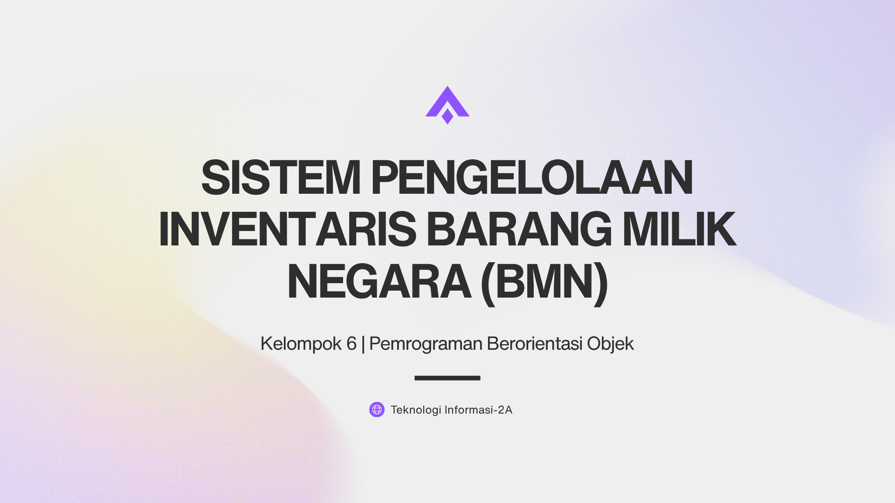

# 📦 Sistem Pengelolaan Inventaris Barang Milik Negara (BMN)

<p align="center">
  
</p>

---

## 📖 Tentang Proyek

<details open>
<summary><b>Klik untuk melihat deskripsi proyek</b></summary>

<br>

Sistem Pengelolaan Inventaris Barang Milik Negara (BMN) merupakan aplikasi berbasis
**Command Line Interface (CLI)** yang dikembangkan menggunakan bahasa pemrograman
**Python** dengan menerapkan konsep **Pemrograman Berorientasi Objek (Object-Oriented Programming/OOP)**.

Program ini dirancang untuk membantu pengelolaan inventaris di lingkungan fakultas,
meliputi pengelolaan data aset, data peminjam, proses peminjaman dan pengembalian aset,
serta pemantauan status aset secara lebih terstruktur dan mudah digunakan.

</details>

---

## 🏫 Identitas Proyek

<details>
<summary><b>Klik untuk melihat identitas proyek</b></summary>

<br>

| Keterangan | Informasi |
|------------|------------|
| Mata Kuliah | Praktikum Pemrograman Berorientasi Objek |
| Program Studi | Teknologi Informasi (S1) |
| Fakultas | Sains dan Teknologi |
| Universitas | Universitas Islam Negeri Salatiga |
| Bahasa Pemrograman | Python |
| Jenis Aplikasi | Command Line Interface (CLI) |
| Kelompok | 6 |

</details>

---

## 👥 Anggota Kelompok

| Nama | Tugas |
|------|--------|
| Silfia Ulkhaq Fitriannisa' | Pengembangan Program dan Implementasi OOP |
| Muhammad Syaikhul Umam | Pengembangan Program, CLI, dan Pengujian |
| Oryza Alpha Azzukhruf | Penyusunan Isi Laporan dan Dokumentasi |
| Azis Khoirul Setiawan | Pemformatan Finalisasi Laporan dan Source Code |

---

## ⚙️ Struktur Project

```text
PBO/
│
├── assets/
│   └── cover.png
│
├── source_code/
│   ├── bmn_inventory_cli.py
│   ├── class_models.py
│   ├── menu_cli.py
│   └── main.py
│
└── README.md
```

---

## 📂 Penjelasan File

<details>
<summary><b>Klik untuk melihat fungsi setiap file</b></summary>

<br>

📄 **bmn_inventory_cli.py**  
Merupakan versi lengkap (single file) dari program Sistem Pengelolaan Inventaris BMN. File ini berisi seluruh implementasi class, logika bisnis, antarmuka Command Line Interface (CLI), validasi input, serta program utama dalam satu berkas Python.

📄 **class_models.py**  
Berisi implementasi seluruh class pada sistem, yaitu `Aset`, `Elektronik`, `Furnitur`, `Kendaraan`, `Peminjam`, dan `SistemInventaris`, serta penerapan konsep Object-Oriented Programming (OOP) meliputi Encapsulation, Inheritance, Polymorphism, dan Aggregation.

📄 **menu_cli.py**  
Berisi implementasi antarmuka berbasis teks (CLI), menu interaktif, proses pengolahan data, serta validasi input pengguna.

📄 **main.py**  
Berisi program utama (*entry point*) yang digunakan untuk menginisialisasi data awal, membuat objek `SistemInventaris`, dan menjalankan antarmuka Command Line Interface (CLI).

📄 **assets/cover.png**  
Berisi banner atau cover project yang ditampilkan pada halaman utama repository GitHub.

📄 **README.md**  
Berisi dokumentasi proyek, identitas kelompok, deskripsi sistem, pembagian tugas, struktur project, penjelasan file, dan panduan menjalankan program.

</details>
